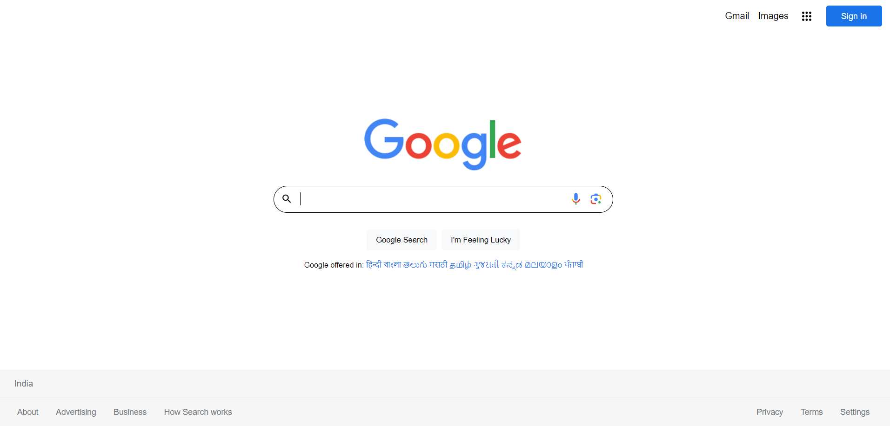

# [__Google Homepage Clone__](https://divyakumar31.github.io/googlehomeclone/)

## __Project details__

-  __The project was created using HTML, CSS, and JavaScript.__
-  __The project replicates the look and functionality of the Google homepage, including the header, navigation bar, search bar, and footer.__
-  __The project also includes the Google logo.__
-  __The project was created as a learning exercise to improve my web development skills.__
-  __The project was a fun and challenging experience that helped me learn about HTML, CSS, and JavaScript.__

## Here is the image how the output looks like

![Demo Image][def]

[def]: GoogleHomepageCloneLight-1.png